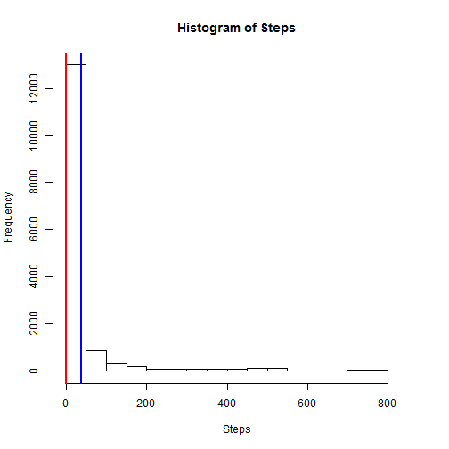
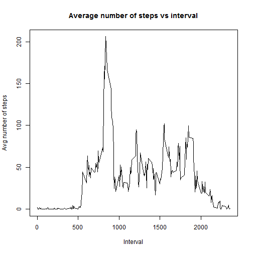
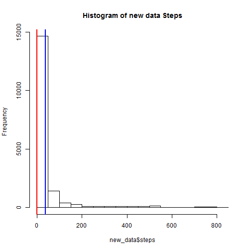
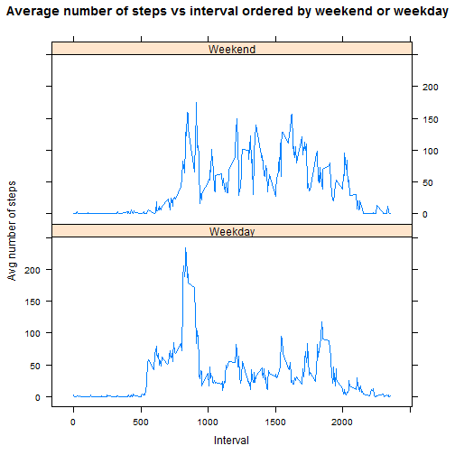

Peer Assessment 1
========================================================

## Load and Preprocess the data


```r
activity <- read.csv("activity.csv", h = T)
```

```
## Warning: cannot open file 'activity.csv': No such file or directory
```

```
## Error: cannot open the connection
```

```r
activity["weekday"] <- weekdays(as.Date(activity$date))
activity["weekend"] <- with(activity, ifelse(weekday == "Sunday" | weekday == 
    "Saturday", "Weekend", "Weekday"))
```


```r
mean_act <- mean(activity$steps, na.rm = TRUE)
median_act <- median(activity$steps, na.rm = TRUE)
```


The **mean** is **37.3826** and **median** is **0**

## Histogram of steps and mean and median. Median is red and mean is blue


```r
hist(activity$steps, main = "Histogram of Steps", xlab = "Steps")
abline(v = mean_act, col = "blue", lwd = 2)
abline(v = median_act, col = "red", lwd = 2)
```

 


## The average daily activity pattern


```r
library(plyr)
mean_step_df <- ddply(activity, .(interval), summarise, mean_steps = mean(steps, 
    na.rm = TRUE))
plot(mean_step_df$mean_steps ~ mean_step_df$interval, type = "l", ylab = "Avg number of steps", 
    xlab = "Interval", main = "Average number of steps vs interval")
```

 


```r
max_int <- mean_step_df[mean_step_df$mean_steps == max(mean_step_df$mean_steps), 
    "interval"]
```


The 5 minute interval with the most steps in the day is 835

## Inputting missing values

### The number of missing values


```r
num_nas <- sum(is.na(activity$steps))
new_data <- activity
for (i in mean_step_df$interval) {
    new_data[is.na(new_data$steps) & new_data$interval == i, "steps"] <- mean_step_df[mean_step_df$interval == 
        i, "mean_steps"]
}
mean_act_new <- mean(new_data$steps)
median_act_new <- median(new_data$steps)
```


The __mean__ for the new data set is **37.3826** and __median__ is **0**


```r
hist(new_data$steps, main = "Histogram of new data Steps")
abline(v = mean_act_new, col = "blue", lwd = 2)
abline(v = median_act_new, col = "red", lwd = 2)
```

 


## Differences between weekday and weekend


```r
library(lattice)
mean_step_weekend_df <- ddply(activity, .(interval, weekend), summarise, mean_steps = mean(steps, 
    na.rm = TRUE))
xyplot(mean_step_weekend_df$mean_steps ~ mean_step_weekend_df$interval | mean_step_weekend_df$weekend, 
    type = "l", ylab = "Avg number of steps", xlab = "Interval", main = "Average number of steps vs interval ordered by weekend or weekday", 
    layout = c(1, 2))
```

 

